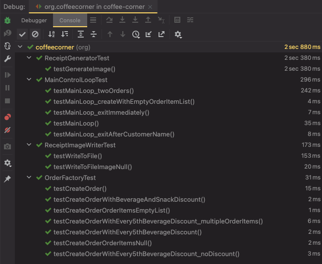
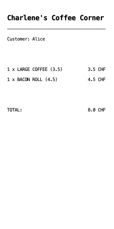
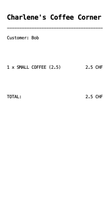

# Coffee Corner

## Running The Application

The main class is: `CoffeeCornerApp.java`

- The program needs one argument `outputFolder` which is a folder for storing the generated receipt images.

### A. Running with Java when project is compiled already by IDE

Can be run like the following: `java org.coffeecorner.CoffeeCornerApp outputFolder`  

E.g. `java org.coffeecorner.CoffeeCornerApp /Users/kokaveczandras/dev/output`  

### B. Compiling and running with Maven from console

E.g. `mvn compile exec:java -Dexec.mainClass="org.coffeecorner.CoffeeCornerApp" -Dexec.args="/Users/kokaveczandras/dev/output"`  

## Assumptions

#### AS-001 - Not allowed to use any library other than Java SE and JUnit

- `Spring`
    - Not allowed to use Spring, so creating beans, wiring application context and dependency injection was done manually.
- `Mockito`
    - Not allowed to use Mockito, so I was creating mocks manually in tests.
- `Hamcrest`
    - Not allowed to use Hamcrest, so e.g. not using `assertThat()` type of nice and readable assertions.

#### AS-002 - Application input

The type of input for the application wasn't defined.  
The limitation here was to only use JAVA SE and no other libraries, so something like a REST API wouldn't work here.  
I was left with options: User Input, File Based Input (e.g. watching a folder with CSV, JSON, XML), etc.  
Therefore I decided to go with User Input via the Scanner.

#### AS-003 - No currency concept

Currency concept is not yet modelled at the moment.  
Prices, amounts, totals are assumed to be in CHF.

#### AS-004 - No VAT calculation

Prices are net prices, VAT is not modelled at the moment.

#### AS-005 - No tip calculation

Tips are not included yet.

#### AS-006 - Unlimited inventory

There is no inventory concept yet, every product is available, we don't track inventory quantities.

## Screenshot of 15 tests running green



## Example output and console interaction

The following console interaction below produced 2 orders & receipt images.

- Receipt for Alice:  
  

- Receipt for Bob:  
  

Console interaction:  

```
/Users/kokaveczandras/Library/Java/JavaVirtualMachines/temurin-11.0.16.1/Contents/Home/bin/java -javaagent:/Applications/IntelliJ IDEA.app/Contents/lib/idea_rt.jar=59713:/Applications/IntelliJ IDEA.app/Contents/bin -Dfile.encoding=UTF-8 -classpath /Users/kokaveczandras/dev/projects/coffee-corner/target/classes org.coffeecorner.CoffeeCornerApp /Users/kokaveczandras/dev/output
***********************************
*  Welcome to Coffee Corner app!  *
***********************************

List of available products:
  0 - SMALL COFFEE
  1 - MEDIUM COFFEE
  2 - LARGE COFFEE
  3 - ORANGE JUICE 0.25l
  4 - BACON ROLL
  5 - EXTRA MILK
  6 - FOAMED MILK
  7 - SPECIAL ROAST COFFEE

Please enter the first name of the customer for bonus program:
User input > Alice

Please enter order items in the format of: ID,QUANTITY
- or type '!C' to create the current order
- or type '!E' to exit the application

User input > 2,1
User input > 4,1
User input > !C

Order created successfully with order id: 0
Generating receipt image...
Writing receipt image to file...
Successfully written receipt image to file to: /Users/kokaveczandras/dev/output/2022-10-28_11-02-49-787_receipt.jpg

List of available products:
  0 - SMALL COFFEE
  1 - MEDIUM COFFEE
  2 - LARGE COFFEE
  3 - ORANGE JUICE 0.25l
  4 - BACON ROLL
  5 - EXTRA MILK
  6 - FOAMED MILK
  7 - SPECIAL ROAST COFFEE

Please enter the first name of the customer for bonus program:
User input > Bob

Please enter order items in the format of: ID,QUANTITY
- or type '!C' to create the current order
- or type '!E' to exit the application

User input > 0,1
User input > !C

Order created successfully with order id: 1
Generating receipt image...
Writing receipt image to file...
Successfully written receipt image to file to: /Users/kokaveczandras/dev/output/2022-10-28_11-03-06-500_receipt.jpg

List of available products:
  0 - SMALL COFFEE
  1 - MEDIUM COFFEE
  2 - LARGE COFFEE
  3 - ORANGE JUICE 0.25l
  4 - BACON ROLL
  5 - EXTRA MILK
  6 - FOAMED MILK
  7 - SPECIAL ROAST COFFEE

Please enter the first name of the customer for bonus program:
User input > !E

Process finished with exit code 0
```
